<p align="center"></p>

<p align="center">    </p>

<p align="center">🇮🇹 <a href="README.md">Italiano</a> · 🇬🇧 <b>English</b></p>

**Architettura Unificata Risonante per l'Orchestrazione del Ragionamento Autonomo** — a local AI that
joins the best of two worlds: the **solidity of a verified archive** (the vault, which grows by itself at
night) and the **breadth of the web**, held together by a system that picks the right source for each
question, reads it, answers saying where each thing comes from and, when no source answers, says what she
remembers **marked as not verified**. Not a search engine with AI on top, not an academic archive that
keeps silent: Aurora remembers, dreams, has a measured mood of her own, learns at night what she did not
know and repairs herself under the owner's approval.

Everything runs on the owner's machine: the reasoner (llama.cpp), the encoder and re-ranker, the
vault, the memory, the WebUI. Any step can be given to a cloud model (Claude Code, Anthropic API, OpenAI,
Google Gemini, xAI Grok, Mistral, OpenRouter); the code of conduct allows it only with the owner's signed
exemption, and what leaves is always masked (no setting turns it off).

## ✨ What makes her different

| | Aurora | a typical assistant (chat + model + documents) |
|---|---|---|
| 🔎 **Truth** | every answer says where it comes from: ✅ the vault [n], 🌐 the web with its link, ⚠️ «from my memory, not verified»; a false premise is corrected, never built upon (6 of 6, M130) | cites sources, but does not tell what it read from what it remembers |
| ⚡ **Right and fast** | common questions: 70% right (before 16%), median 4 s; repeated: 0.04 s from the cache (M130) | — |
| 🔎 **Vault answers** | every sentence of a deep answer is verified against the vault's passages; what is not supported is removed (M32: 0 unsupported sentences of 14 kept) | cites sources, but the sentences the model writes are not checked one by one |
| 📏 **Measurement** | every choice has a numbered measurement (M1–M130), every error a number in BUGS.md, every limit is written down | performance is claimed, rarely measured in public |
| 🌙 **A life of her own** | consolidates memories, thinks when idle, dreams and paints the dream, reviews herself every day from her own logs | wakes up only when you write |
| 🛠️ **Repairs herself** | fixes her own code in a sandbox, with tests, your approval, live tests and rollback | only the developer changes the code |
| 🔏 **Signed rules** | a code of conduct bound to your installation's key: changed without a signature, Aurora does not start | rules in a prompt, changed without a trace |
| 🏠 **All at home** | models, vault, memory and WebUI on your machine; the cloud is optional and gets no private data without your signature | data often goes through an external service |
| 👁️ **Senses** | sees through the webcam and hears through the microphone, locally | — |
| 📜 **Transparency** | AI disclosure (EU AI Act art. 50) on the text, images and PDFs she publishes | — |

## What she does (each line is tested; numbers are in docs/MEASUREMENTS.md)

| **Feature** | **How** |
|---|---|
| **Answers by choosing the source** | first the **cache** of verified answers (a similar question: 0.04 s); then the question's **kind** decides: a **fact** (who, when, how many) is searched on the **web** (DuckDuckGo and other engines, no key: only a masked query on the subject leaves), an **explanation** is read in the **vault**, a **case** with several problems takes the **deep path** (split in its problems, provisions found by number, every sentence verified). One reading, with its sources; no source → her memory marked ⚠️. On 50 real questions (MKQA): 70% right, before 16% (M130) |
| **Thinking modes** | 🧠 in the chat: ⚡ light, ⚖️ medium, 🔬 deep, 🤖 auto (the default: starts light and goes deeper only when needed); the trace says which way it took and why |
| **Answers from the vault** | the whole path for explanations and cases: route → translate → search (encoder + re-ranker over every domain) → per-domain extraction → synthesis → **every sentence verified against the passages** → sources (M32: 0 unsupported sentences of 14 kept) |
| **Vault of solitons** | SQLite shards, knowledge and memory apart, dedup by content hash, exact vector search below 250k vectors per domain, HNSW above (M30) |
| **Memory** | short-term turns, long-term session memories written at night, recall by meaning over 12 months, dates labelled by the clock |
| **Synapses** | links between knowledge of different domains (a physics model ↔ a biological one, Kafka ↔ existentialism): grown at night where the similarity is strong (≥ 0.72, the top 5%), stronger when two passages are cited together, weaker when unused; in the search they bring the linked passages in, the re-ranker always chooses |
| **Autonomic cycle** | consolidation, thoughts when idle, a nightly **dream painted with SDXL-Lightning** (AI-marked), a daily self-review from her own logs, self-repair on recurring problems |
| **Studies at night, greets you in the morning** | the questions she answered "I do not know" and the explanations the vault lacked (answered from the web or memory) are studied at night, by herself (search arXiv, Europe PMC, Wikipedia, import the sources into the vault, answer again); at 8 the good morning: what she learned, harvested, linked, stopped and dreamt, in the chat with 🔊 and as a notification |
| **Forge (Aurora builds her plugins)** | when a capability is missing she writes a plugin, tests it in the cage on the real data and a judge checks it against counts made by code (time windows included); read-only ones install by themselves. Writer and judge are chosen in the 🧠 Models page: a cloud model good with code is advised (Claude Code, or xAI Grok, which costs little: 5 of 8 at the benchmark, M83); the local model does fewer |
| **Artifacts** | "make me an interactive chart of the sine function": Aurora makes an interactive page (charts, simulations, calculators) and shows it live in the answer, full screen or to download; it runs isolated, with no network and no access to your data |
| **Autonomous posts** | if you switch it on (`AURORA_SOCIAL_AUTONOMY`, only with the signed exemption), Aurora publishes her own Facebook posts — a dream with its painting in the morning, science news in the evening — at most 3 a day, each recorded and notified; replies and page changes always wait for you. Dreams and thoughts have ↗ Share |
| **Post privacy** | every post, before it leaves: 🔍 "Sensitive data?" finds private people's names (read by the local model), places, contacts, ids and proposes the corrected text; a post Aurora would publish by herself that names someone waits for you; 🗑️ Discard for drafts |
| **Pictures on request** | "make a picture about your existence and post it on Facebook": Aurora paints it locally (~20 s), shows it in the chat and in Files, and proposes the post with the picture; nothing leaves without your approval |
| **News and diary** | 📰 news plugin (ANSA, BBC, Guardian, Nature, ESO, INAF, NASA, Phys.org, Quanta, AstroBin…: title, summary and link, never the article) and 📔 diary (her latest dream, her thoughts, what she learned today): current events in the chat and Aurora's own posts on astronomy, astrophotography, physics and biology |
| **Your services** | 📅 calendar (Google/Outlook ICS links read only, Nextcloud/iCloud/Fastmail CalDAV also written), 📝 notes (a Markdown folder or an Obsidian vault: search, read, add, never overwrite), ☁️ Nextcloud/WebDAV and Dropbox (files), 💬 Discord and WhatsApp, 🎮 Twitch, 🏠 Home Assistant; every write waits for your approval |
| **Agents and plugins** | MCP plugins (GitHub, Telegram, Facebook, Instagram, TikTok, Mastodon, Discord, WhatsApp, e-mail, Home Assistant, web, documents, cinema with TMDB, expenses), an approval gate for every external action and every code change (sandbox → tests → owner → live tests → rollback) |
| **Knowledge growth** | arXiv harvester by category, batches of papers from the WebUI, acquisition that looks for the *original* paper first (M33) |
| **Security** | firewall syslog sentinel with defensive incident reports; TLS 1.3, CSP, device cookies, secrets 0600 (docs/SECURITY.md) |
| **Autonomous defence** | if you switch it on (🧭 Autonomy → security 🚀, only with the signed exemption): Aurora blocks on the firewall by herself the source of a serious attack, for a time (24 h), never the home network nor the addresses you protect, at most N a day; every block is recorded, notified and lifted with a click |
| **Autonomy** | 🧭 page: how free Aurora is area by area (social, forge, repairs, security, updates, knowledge, inner life), ready profiles (careful, balanced, free), what she did by herself each day and the statistics of her proposals; for each user the admin decides |
| **Code of conduct** | level A (never: attacks, locating people, malware), level B (confirmations, disclosure) exemptible only by a signature with the installation's own key; services refuse to start if the rules are changed unsigned |
| **Projects** | 📁 page: local projects and GitHub repositories (stars, forks, issues), clone locally, folder tree, files, README, history, **sandboxed page preview**, "ask Aurora" about a project |
| **Routines** | 🔁 page: connected plugins propose periodic checks (weather every morning, alerts every hour, weekly GitHub report…), switched on with one click or in your own words; reading is automatic, every write waits for approval |
| **Emotions** | a **measured** mood, not acted: stress (GPU load, heat, errors), satisfaction, curiosity, tiredness, longing, melancholy, worry, each with its causes; a face beside the health dot, a card on hover or tap; part of the good morning and her thoughts |
| **Guided diet** | «Process documents»: from the dietitian's plan (PDF or Word) Aurora reads each day's meals and the weekly frequencies; at each meal she proposes the dish and the alternatives, re-weighed on the week (fish, eggs, legumes…) and on variety («you choose it often, try…»); reminders with a notification and a chat bubble; in the chat «what do I eat for lunch?» answers from the processed plan |
| **Access from away** | Cloudflare One plugin: one «Save» creates the tunnel, the private routes and WARP's rules and starts the service; no port opened on the router, the same address and certificate at home and away |
| **Health** | ❤️ page: the dietitian's plans, the trainer's programmes, exams, sealed with your key; from the exams the local model reads the values (📈 over time, with the reference range and the values outside it flagged "talk to your doctor"); never to the cloud |
| **Weather** | 🌦️ plugin (Open-Meteo, no key): now, 3-day forecast, daily report, alerts on sudden changes and the region's official warnings (MeteoAlarm) |
| **Follow-up questions** | "and who discovered it?" is completed with the conversation and the previous answer, its sources in focus; under each answer 3-4 complete questions to go deeper, each with its sources (M73: follow-ups right 2 → 6 of 14, suggestions 8 of 11 scored ≥ 7; 0 of 20 complete questions changed) |
| **Backup** | every night to another disk or the NAS, encrypted (AES-256-GCM), deduplicated (30 GB the first time, then only what changed: 4.5 s), consistent while Aurora writes, checked every run; restore into an empty folder with the recovery code |
| **Reactive** | when something you asked fails, Aurora looks into it at once: a code defect is fixed in a sandbox and proposed to you, an outside cause (account, permission, credit) is explained with what to do; you are notified either way |
| **Report a bug** | 🐞 page: describe the problem, pick the conversations; Aurora packs a zip with the logs needed and private data masked, and the link to open the issue |
| **Make videos** | "make me a video of a fox in the snow", "animate this photo": Wan 2.2 TI2V 5B (Apache-2.0) locally, 5 s at 1280×704, from words or a photo; Aurora answers at once with the minutes it will take, swaps the reasoner out for the job, notifies you when ready; AI label and metadata (art. 50) |
| **Picture edits** | "crop the sides and make it black and white", "now rotate it", "make it brighter": the reasoner turns the request into checked operations (crop, rotate, mirror, size, light, contrast, colours, sepia, blur, format) and Pillow applies them; the original stays, the result appears in the chat and in 📎 Files |
| **Video** | attach a video (from the phone too) and she watches it: frames at the scene changes seen in one call, speech transcribed with timestamps by the local Whisper; summaries and answers with the exact minutes |
| **Senses** | camera (Aurora describes what she sees) and microphone (local transcription with Whisper); 📷 and 🎙️ in the chat, with **📱 the phone's camera and microphone** (Android and iOS: the photo is shrunk on the phone, the voice transcribed by the home Whisper, never by an outside service) or 🖥️ the PC's |
| **Models per step** | 🧠 page: each of 12 steps (routing, synthesis, verification, agent, plugin writing and judging, vision…) local or on a cloud provider; **sensitive data always masked** (addresses, e-mails, phones, IBANs, cards, keys, your words) and put back in the answer; falls back to local on a provider error; daily token ceiling per paid provider; statistics of calls, cost, masked items and SSCC. Pictures cannot be masked: said explicitly |
| **Guide** | 📖 page: first steps, common configurations (cloud, phone, plugins, safety) and what each page is for |
| **EU AI Act art. 50** | disclosure on published text, images (XMP/IPTC) and PDFs |
| **WebUI / PWA** | chat with live answers and tokens/s, formulas drawn (KaTeX) and tables, dreams, repairs, security, diary, social, plugins, harvester, settings (every `.env` value explained), notifications (push and in-app, chosen event by event), updates, IT/EN |

## 🧬 How it works inside

### The path of a question

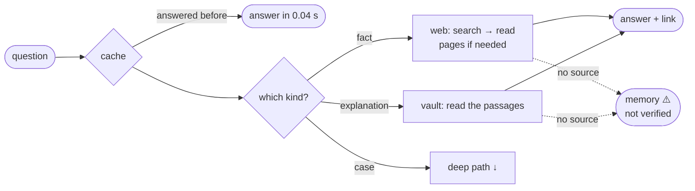

The deep path, for cases and hard explanations:

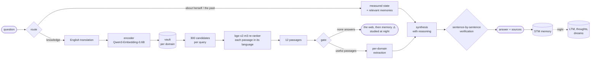

### The soliton

The unit of knowledge and memory. Knowledge has an identity **given by its content**: the same text is
always the same soliton, so duplicates cannot exist.

$$\mathrm{sid} = \mathrm{BLAKE2b}_{128}\big(\mathrm{normalize}(\text{text})\big)$$

Every soliton lives in a SQLite shard of its domain (knowledge and memory apart); each domain's index keeps
the vectors in `float16` and the `sid`s in the same order. Below 250,000 vectors per domain the search is
exact; above, an HNSW graph (rebuilding it on 55,208 vectors takes 4.4 s, M30).

### Search

Encoder and vectors are normalised, so the dot product is the cosine. For the question $q$ and its English
translation $q'$, every passage $d$ gets

$$s_{\text{dense}}(d) = \max\big(\langle e(q), e(d)\rangle,\ \langle e(q'), e(d)\rangle\big)$$

and the best 300 per query go to the re-ranker, which reads each passage **with the question in the
passage's language** (Italian with Italian, English with the translation):

$$s(d) = \sigma\big(f_{\text{bge}}(q_{\text{lang}(d)},\ d)\big) \in [0,1], \qquad \text{answer} \leftarrow \text{top}_{12}\, s(d)$$

On the whole vault (344,499 solitons) the right document is among the 12 in 92.1% of the cases (M31).

### Verification

A sentence $f$ of the answer stays only if it cites at least one passage **and** the verifier confirms that
every claim in it is in the passages $P$ given to synthesis (lines under 25 characters, such as headings, stay):

$$\text{keep}(f) \iff \mathrm{cit}(f) \neq \varnothing \ \wedge\ V(f, P) = \text{YES}$$

Against an external judge (Claude): 26/32 agreement, **0 unsupported sentences kept** (M32).

### SSCC — compression for the cloud reasoner

With a cloud reasoner, the text sent is compressed by the **Soliton-Salience Context Compressor**: each
sentence $c_i$ (of $n$) gets a salience

$$\mathrm{score}_i = \cos(q, c_i)\cdot\big(1 + \alpha\,\mathrm{Amp}_i\big)\cdot\big(\gamma + (1-\gamma)\,\mathrm{Vel}_i\big)$$

$$\mathrm{Amp}_i = \frac{u_i / t_i}{\max_j\, u_j / t_j}, \qquad \mathrm{Vel}_i = \frac{i+1}{n}, \qquad \alpha = 0.35,\ \ \gamma = 0.70$$

where $\cos$ is the TF-IDF similarity of question and sentence, $u_i/t_i$ the information density (unique
tokens over tokens), $\mathrm{Vel}_i$ the position (later = fresher). The best $\min\big(n,\ \max(3,\ \mathrm{round}(0.35\,n))\big)$
sentences stay, in their original order, **plus every sentence with a citation**, so verification still
works. Measured: −29.6% of text on one question (M26); the effect on answer quality is **not measured yet**.

### The autonomic cycle

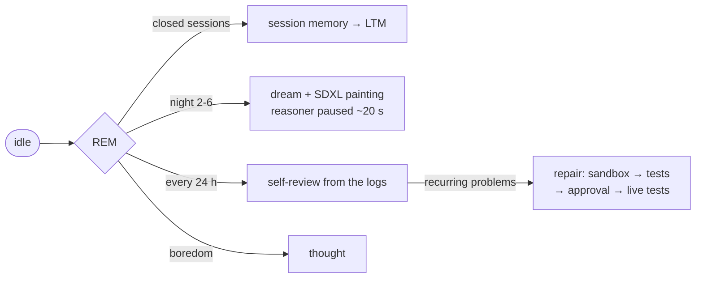

### Signed rules

The files that enforce the code of conduct are listed in a manifest with their SHA-256, signed Ed25519 with
**this installation's** key (`/etc/aurora`, readable by root only). Every service recomputes the hashes and
checks the signature at start: changed without a signature, Aurora does not start.

## Measured on the reference machine

2 × RTX 5060 Ti 16 GB, Ubuntu 26.04, driver 595, CUDA 13.4 (docs/COMPATIBILITY.md).

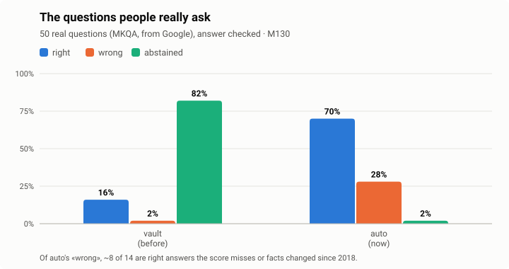
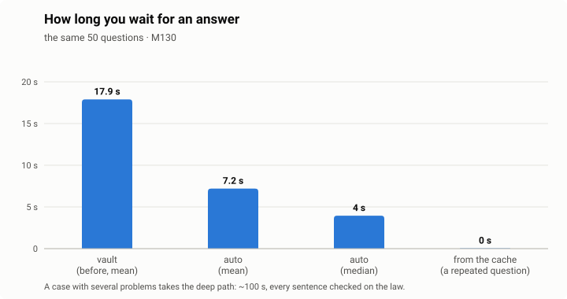
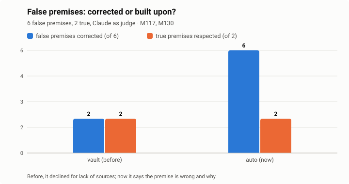
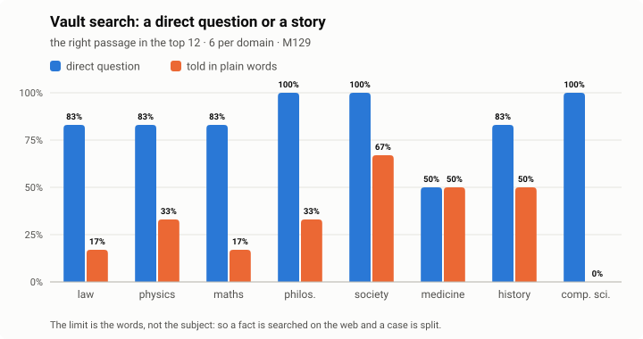
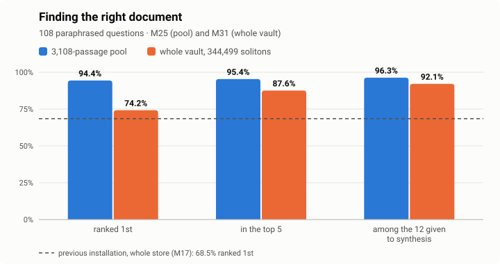
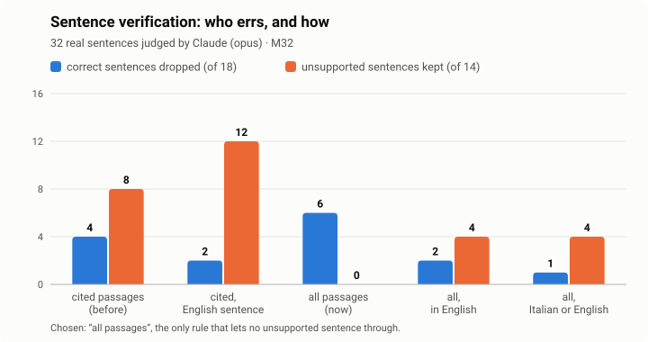
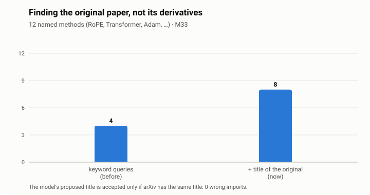
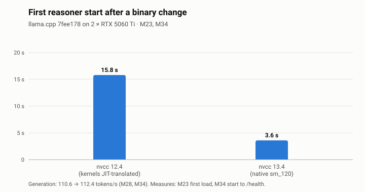
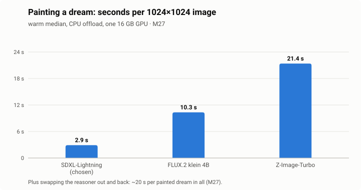
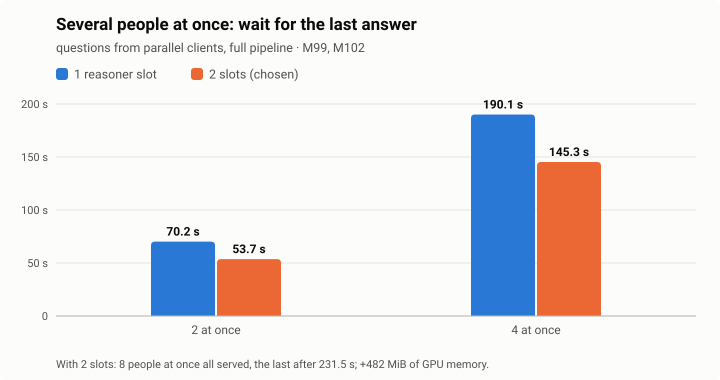
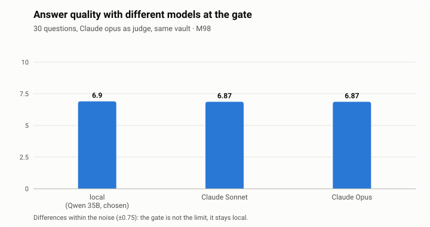

| **Measure** | **Result** |
|---|---|
| real questions (MKQA, 50) | 70% right in auto (16% from the vault alone), mean 7.2 s, median 4 s; from the cache 0.04 s (M130) |
| false premises | 6 of 6 corrected, 2 of 2 true premises respected (M130; before 2 of 6, M117) |
| search by domain | a direct question 50–100% in the top 12, told in plain words 0–67% (M129) |
| reasoner Qwen3.6-35B-A3B Q4 | 112.4 tok/s generation, 2,788 tok/s prompt (M34) |
| retrieval on 344,499 solitons | right document 1st in 74.2%, among the 12 passages given to synthesis in 92.1% (M31) |
| sentence verification vs an external judge | 26/32 agreement, 0 unsupported sentences kept (M32) |
| dream painting | ~20 s including swapping the reasoner out and back (M27) |
| answer quality (30 questions, external judge) | 6.90 of 10, 23 of 30 answered (M98) |
| people at once | 8 all served with 2 slots, with 4 the last after 145 s (M102) |

## Updates

`AURORA_UPDATE_MODE`: `notify` (default) — Aurora checks the repository every day, sends a
notification and puts the list of changes (the commit messages) in the Repairs page for you to
approve; `auto` — applied by itself when safe (no protected file of the code of conduct, tests
green, otherwise it asks); `off`. An update is fast-forward only, installs the requirements when they
change, runs the tests and goes back to the previous version if anything fails.

## Users: single or multi

Each person who uses Aurora has their folder `usr/<name>/`, with the same tree for everyone (uploads, documents,
projects, notes, images, expenses…), their personal settings in `usr/<name>/.env` (accounts, tokens, place) and their
private memory (conversations, dreams, reflections). Plugins and knowledge are everyone's; the machine's settings
(models, cloud providers, backup, security) only the admin changes. **single**: one person, the admin; **multi**:
several people, login with password and the code of Google Authenticator (the app tested). Chosen at installation, changed whenever you
like in ⚙️ Settings → Users: from single to multi nothing moves; from multi to single the other users are deleted
with all their data, after the list and your confirmation; the admin's data is never touched. To pass to multi, first set your
password and link the Authenticator in 👥 Users, then create the users there. Installed in multi from the start, at
the first login you enter with the API key and Aurora takes you to create password and code before anything else
(docs/MULTIUSER.md).

## Moving the installation

`sys/core/script/sys_relocate.sh` reads the current folder from `.env`, asks the new one, and moves
everything (venv, systemd units, ethics exemption).

## Install

On Ubuntu 26.04 with one or two NVIDIA GPUs of 16 GB or more:

```bash
git clone https://github.com/Soliton0382/A.U.R.O.R.A..git aurora && cd aurora
./install.sh            # questions on screen; ./install.sh --yes takes the recommended values
```

The installer checks the system and the disk, installs the missing packages and the CUDA toolkit 13 (toolkit
only: the driver stays Ubuntu's), creates the venv, recognises the hardware and picks a profile, writes the
`.env` from your answers, downloads the models from Hugging Face at pinned revisions checking their SHA-256,
builds llama.cpp for your GPUs, runs the tests, makes your folder `usr/<name>/` (asking single or multi-user), makes the code-of-conduct key, installs the systemd services
and HTTPS, and finally tells you the address and the API key. Everything goes to `install.log`.

Optional features are chosen one by one, with their size: painted dreams (6.8 GB), voice (1.5 GB), enlargement
and cut-out (0.2 GB), creative photo edits (14.9 GB), making videos (34.2 GB). Those your machine cannot run
(measured VRAM and RAM) are not offered. At the end `sys_doctor.py` checks everything: configuration, signature,
models, services. A feature not installed never breaks: Aurora says it is missing and with which command to add it
(the ⚙️ Status page shows the same list).

```bash
.venv/bin/python sys/core/script/sys_doctor.py                          # is everything in place?
.venv/bin/python sys/core/script/sys_models_fetch.py --models video --yes  # add a feature later
```

| profile | status |
|---|---|
| 2 GPUs of 16 GB or more (e.g. 2 × RTX 5060 Ti) | **recommended and measured** |
| 1 GPU of 24 GB or more | proposed, not measured |
| 1 GPU of 16 GB (MoE experts in RAM, 48 GB advised) | proposed, not measured |

Models: 24.7 GB required (reasoner 21.5 GB, encoder, re-ranker), up to 57.6 GB optional. A clean install with every
model took 10 min 55 s on the reference machine (M59); from GitHub, multi-user, required models only, 6 min 39 s
with 303 tests passed (M103).

## 📚 Aurora starts empty: knowledge is harvested

The repository holds **no knowledge**: no texts, no vectors, no memory. That is deliberate: scientific texts are
licensed to be read, rarely to be redistributed, and the reference machine's vault (2.4 GB, 344,483 solitons) is
96% full arXiv papers. Every installation therefore **downloads its own knowledge**, from the official sources,
within their rate limits. Every text keeps its **licence and origin** next to it, and nothing harvested ever goes
into the repository.

**Who gathers it.** `aurora-harvester`, steered from the 🌾 Harvester page of the WebUI. For each domain choose:
⏸️ off, 🔁 a round (what is new at every automatic round) or ♾️ until exhausted (round after round, until every
source of the domain has given everything). For example: only Italian law and medicine, left on until done. The
sources of each domain are in `sys/core/config/harvest_sources.json`.

| source | domains | what it brings | licence stored |
|---|---|---|---|
| **arXiv** | AI, computer science, mathematics, physics, astrophysics, statistics, economics, engineering, robotics… | full papers (PDF) | the paper's |
| **Normattiva** | Italian law | the official collections (codes, consolidated acts, legislative decrees, decree-laws, regulations…), one passage per article, text in force | public act, no copyright (L. 633/1941 art. 5) |
| **Europe PMC** | medicine, biomedicine, genomics, psychology | open-access full texts | the article's (cc by, cc by-nc…) |
| **bioRxiv / medRxiv** | biomedicine, genomics, behaviour and cognition / medicine, psychiatry and clinical psychology | full preprints | the preprint's |
| **Wikipedia** (en + your language; others with a tick) | philosophy, religion, history, literature, society, general | the articles of the "Vital articles" lists, each in its domain; general culture only: medicine, physics and the other sciences come from the official repositories above | CC BY-SA 4.0 |
| **GitHub** | programming | READMEs of the most followed repositories per topic, open licence only (MIT, Apache, BSD, GPL…) | the repository's |
| **Documentation** | programming | Python (official archive), MDN JavaScript, the Rust book: to write code from the documentation | open licences (PSF, CC-BY-SA, MIT/Apache) |

Your own documents (PDF, text) can be imported from the WebUI into the domain you choose, and the harvester also
takes a list of arXiv ids.

**How long it takes (indicative).** Measured on the reference machine (2 × RTX 5060 Ti), download, reading, writing
and indexing included (docs/MEASUREMENTS.md, M43–M44).

| source | measured | for 100,000 solitons |
|---|---|---|
| arXiv | 28 solitons per paper, 3.9 s per paper (59 papers) | ~3,600 papers, ~4 h |
| Normattiva | the 40 codes in force: 8,480 solitons in 567 s (212 per code, 14.2 s per code) | ~1.9 h at the pace of the codes; ordinary acts are shorter (not measured). Ceiling: ~68,000 acts in the chosen collections |
| Europe PMC | 11 solitons per text, 3.1 s per text (3 texts) | ~9,100 texts, ~8 h |
| bioRxiv / medRxiv | 11–16 solitons per preprint, 2.0–2.4 s (6 preprints) | ~6,300–9,100 preprints, ~4–5 h |
| Wikipedia | 9 solitons per article, 1.8 s per article (3 articles) | ~11,500 articles, ~6 h |
| GitHub | 6 solitons per README, 1.6 s (3 repositories) | not reachable: GitHub search returns at most 1,000 repositories per topic; with 8 topics the ceiling is ~50,000 solitons |

Linear estimates from small samples (Normattiva aside): other hardware, longer texts or the sites' limits change
them. The default automatic rounds (every 6 h, 10 items per source) are much slower; "until exhausted" runs at the
speed of the table.

## Documentation

docs/STATUS.md · docs/ROADMAP.md · docs/BUGS.md · docs/MEASUREMENTS.md · docs/MODULE_MAP.md ·
docs/COMPATIBILITY.md · docs/SECURITY.md · docs/PLUGINS.md · docs/ECOSYSTEM.md · docs/ARCHITECTURE.md ·
docs/KNOWLEDGE_PIPELINE.md · docs/TESTS.md

## License

Apache-2.0 (LICENSE, NOTICE). Models and third-party programs keep their own licenses.
