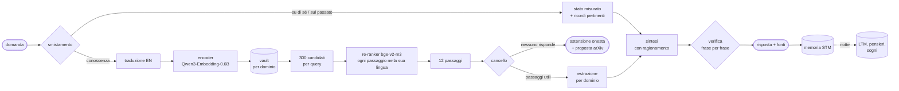
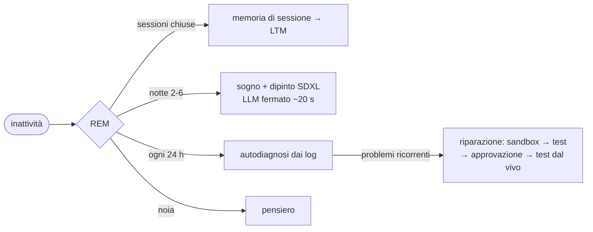
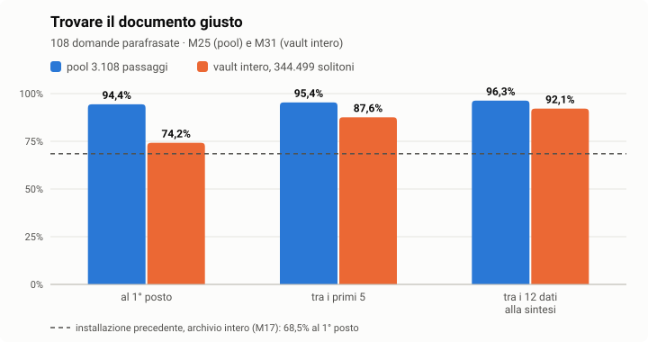
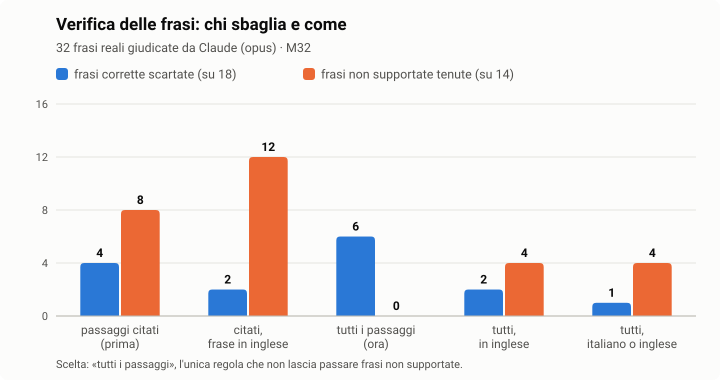
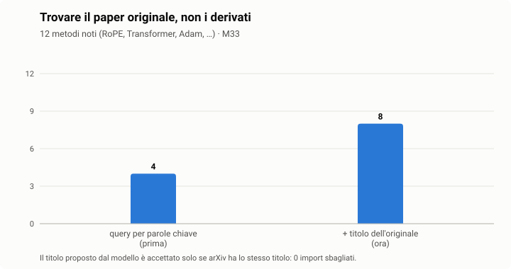
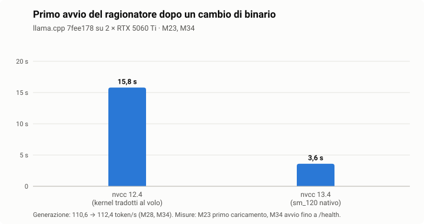
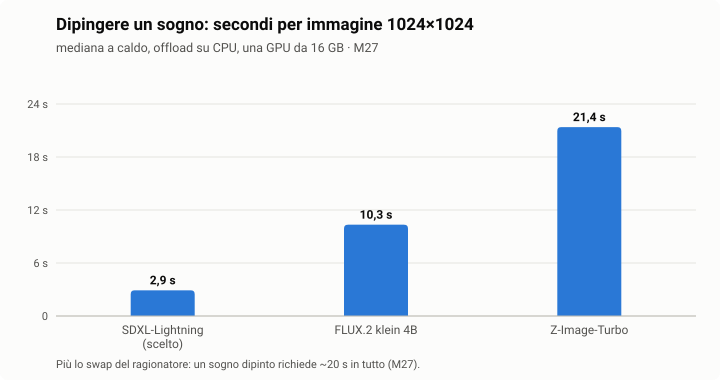

<p align="center"></p>

<p align="center">    </p>

<p align="center">🇮🇹 <b>Italiano</b> · 🇬🇧 <a href="README.en.md">English</a></p>

**Architettura Unificata Risonante per l'Orchestrazione del Ragionamento Autonomo** — un'intelligenza
artificiale locale che risponde solo con conoscenza che sa mostrare, ricorda, sogna, si ripara con
l'approvazione del proprietario e dice "non lo so" quando il vault non lo sa.

Tutto gira sulla macchina del proprietario: il ragionatore (llama.cpp), l'encoder e il re-ranker, il
vault, la memoria, la WebUI. Per i ruoli di ragionamento si può scegliere un ragionatore cloud (API
Anthropic o Claude Code); il codice di condotta vieta di mandarci dati privati senza l'esenzione
firmata dal proprietario.

## ✨ Cosa la rende diversa

| | Aurora | un assistente tipico (chat + modello + documenti) |
|---|---|---|
| 🔎 **Verità** | ogni frase della risposta è verificata sui passaggi del vault; ciò che non è supportato viene tolto, e se non c'è nulla si astiene (M32: 0 frasi non supportate su 14) | cita le fonti, ma le frasi scritte dal modello non vengono controllate una per una |
| 📏 **Misura** | ogni scelta ha una misura numerata (M1–M35), ogni errore un numero in BUGS.md, ogni limite è scritto | le prestazioni si dichiarano, raramente si misurano in pubblico |
| 🌙 **Vita propria** | consolida i ricordi, pensa quando si annoia, sogna e dipinge il sogno, fa un'autodiagnosi quotidiana dai propri log | si attiva solo quando le scrivi |
| 🛠️ **Si ripara** | corregge il proprio codice in una sandbox, con test, la tua approvazione, test dal vivo e rollback | il codice lo cambia solo lo sviluppatore |
| 🔏 **Regole firmate** | codice di condotta con la chiave della tua installazione: se qualcuno lo modifica senza firma, Aurora non parte | regole nel prompt, modificabili senza traccia |
| 🏠 **Tutto in casa** | modelli, vault, memoria e WebUI sulla tua macchina; il cloud è facoltativo e non riceve dati privati senza la tua firma | spesso i dati passano da un servizio esterno |
| 👁️ **Sensi** | vede dalla webcam e sente dal microfono, in locale | — |
| 📜 **Trasparenza** | dichiarazione IA (AI Act art. 50) su testi, immagini e PDF che pubblica | — |

## Cosa fa (ogni riga è testata; i numeri sono in docs/MEASUREMENTS.md)

| **Funzione** | **Come** |
|---|---|
| **Risponde dal vault** | smistamento → traduzione → ricerca (encoder + re-ranker su tutti i domini) → estrazione per dominio → sintesi → **ogni frase verificata sui passaggi** → fonti. Le frasi non supportate vengono tolte (M32: 0 su 14 passano); se non trova nulla, si astiene onestamente e propone di cercare su arXiv |
| **Vault di solitoni** | shard SQLite, conoscenza e memoria separate, deduplica per hash del contenuto, ricerca vettoriale esatta sotto i 250k vettori per dominio, HNSW sopra (M30) |
| **Memoria** | turni a breve termine, memorie di sessione a lungo termine scritte di notte, richiamo per significato su 12 mesi, date etichettate dall'orologio |
| **Ciclo autonomo** | consolidamento, pensieri quando si annoia, un **sogno notturno dipinto con SDXL-Lightning** (marcato come IA), un'autodiagnosi quotidiana dai propri log, autoriparazione sui problemi ricorrenti |
| **Agenti e plugin** | plugin MCP (GitHub, Telegram, Facebook, Mastodon, e-mail, Home Assistant, web, documenti…), un cancello di approvazione per ogni azione esterna e ogni modifica al codice (sandbox → test → proprietario → test dal vivo → rollback) |
| **Crescita della conoscenza** | harvester arXiv per categoria, batch di paper dalla WebUI, acquisizione che cerca prima il paper *originale* (M33) |
| **Sicurezza** | sentinella del syslog del firewall con rapporti difensivi sugli incidenti; TLS 1.3, CSP, cookie per dispositivo, segreti 0600 (docs/SECURITY.md) |
| **Codice di condotta** | livello A (mai: attacchi, localizzare persone, malware), livello B (conferme, dichiarazione IA) esentabile solo con una firma con la chiave della propria installazione; i servizi non partono se le regole cambiano senza firma |
| **Progetti** | pagina 📁: progetti locali e repository GitHub (stelle, fork, issue), clone in locale, albero delle cartelle, file, README, storia, **anteprima delle pagine in sandbox**, «chiedi ad Aurora» su un progetto |
| **Routine** | pagina 🔁: i plugin collegati propongono controlli periodici (meteo ogni mattina, allerta ogni ora, report GitHub settimanale…), si attivano con un clic o a parole tue; lettura automatica, ogni scrittura aspetta l'approvazione |
| **Meteo** | plugin 🌦️ (Open-Meteo, senza chiave): adesso, previsioni a 3 giorni, bollettino giornaliero, allerta sui cambi repentini e allerte ufficiali della regione (MeteoAlarm) |
| **Modifica immagini** | «ritagliala ai lati e mettila in bianco e nero», «ora ruotala», «rendila più luminosa»: il ragionatore traduce la richiesta in operazioni controllate (ritaglio, rotazione, specchio, dimensioni, luce, contrasto, colori, seppia, sfocatura, formato) e Pillow le esegue; l'originale resta, il risultato compare in chat e nei 📎 File |
| **Video** | le alleghi un video (anche dal telefono) e lo guarda: fotogrammi ai cambi di scena visti in una sola chiamata, voce trascritta con i tempi dal Whisper locale; riassunti e risposte con i minuti esatti |
| **Sensi** | videocamera (Aurora descrive ciò che vede) e microfono (trascrizione locale con Whisper); 📷 e 🎙️ in chat, con **📱 fotocamera e microfono del telefono** (Android e iOS: la foto viene ridotta sul telefono, la voce trascritta dal Whisper di casa, mai da servizi esterni) o 🖥️ quelli del PC |
| **AI Act UE, art. 50** | dichiarazione su testi pubblicati, immagini (XMP/IPTC) e PDF |
| **WebUI / PWA** | chat con risposte in diretta e token/s, sogni, riparazioni, sicurezza, diario, social, plugin, harvester, impostazioni (ogni valore del `.env` spiegato), notifiche (push e nella WebUI, scelte evento per evento), aggiornamenti, IT/EN |

## 🧬 Come funziona dentro

### Il percorso di una domanda



### Il solitone

L'unità di conoscenza e di memoria. La conoscenza ha un'identità **data dal contenuto**: lo stesso testo
è sempre lo stesso solitone, quindi i duplicati non esistono.

$$\mathrm{sid} = \mathrm{BLAKE2b}_{128}\big(\mathrm{normalize}(\text{testo})\big)$$

Ogni solitone vive in uno shard SQLite del suo dominio (conoscenza e memoria separate); l'indice di ogni
dominio tiene i vettori in `float16` e gli `sid` nello stesso ordine. Sotto i 250.000 vettori per
dominio la ricerca è esatta; sopra, un grafo HNSW (ricostruirlo su 55.208 vettori costa 4,4 s, M30).

### La ricerca

Encoder e vettori sono normalizzati, quindi il prodotto scalare è il coseno. Per la domanda $q$ e la sua
traduzione inglese $q'$, ogni passaggio $d$ riceve

$$s_{\text{dense}}(d) = \max\big(\langle e(q), e(d)\rangle,\ \langle e(q'), e(d)\rangle\big)$$

e i 300 migliori per query passano al re-ranker, che legge ogni passaggio **con la domanda nella sua
lingua** (italiano con italiano, inglese con la traduzione):

$$s(d) = \sigma\big(f_{\text{bge}}(q_{\text{lingua}(d)},\ d)\big) \in [0,1], \qquad \text{risposta} \leftarrow \text{top}_{12}\, s(d)$$

Sul vault intero (344.499 solitoni) il documento giusto è tra i 12 nel 92,1% dei casi (M31).

### La verifica

Una frase $f$ della risposta resta solo se cita almeno un passaggio **e** il verificatore conferma che
ogni sua affermazione è nei passaggi $P$ dati alla sintesi (le righe sotto i 25 caratteri, come i titoli, restano):

$$\text{tieni}(f) \iff \mathrm{cit}(f) \neq \varnothing \ \wedge\ V(f, P) = \text{SÌ}$$

Contro un giudice esterno (Claude): 26/32 in accordo, **0 frasi non supportate tenute** (M32).

### SSCC — compressione per il ragionatore cloud

Quando si usa un ragionatore cloud, il testo inviato viene compresso con il **Soliton-Salience Context
Compressor**: ogni frase $c_i$ (su $n$) riceve una salienza

$$\mathrm{score}_i = \cos(q, c_i)\cdot\big(1 + \alpha\,\mathrm{Amp}_i\big)\cdot\big(\gamma + (1-\gamma)\,\mathrm{Vel}_i\big)$$

$$\mathrm{Amp}_i = \frac{u_i / t_i}{\max_j\, u_j / t_j}, \qquad \mathrm{Vel}_i = \frac{i+1}{n}, \qquad \alpha = 0{,}35,\ \ \gamma = 0{,}70$$

dove $\cos$ è la similarità TF-IDF tra domanda e frase, $u_i/t_i$ la densità d'informazione (token unici
sui token), $\mathrm{Vel}_i$ la posizione (più recente = più fresca). Restano le migliori
$\min\big(n,\ \max(3,\ \mathrm{round}(0{,}35\,n))\big)$ frasi, nell'ordine originale, **più tutte quelle con una citazione**,
così la verifica funziona ancora. Misurato: −29,6% di testo su una domanda (M26); l'effetto sulla qualità
delle risposte **non è ancora misurato**.

### Il ciclo autonomo



### Le regole firmate

I file che applicano il codice di condotta sono elencati in un manifesto con il loro SHA-256, firmato
Ed25519 con la chiave **di questa installazione** (`/etc/aurora`, leggibile solo da root). Ogni servizio,
all'avvio, ricalcola gli hash e verifica la firma: se qualcosa è cambiato senza firma, Aurora non parte.

## Misure sulla macchina di riferimento

2 × RTX 5060 Ti 16 GB, Ubuntu 26.04, driver 595, CUDA 13.4 (docs/COMPATIBILITY.md).







| **Misura** | **Risultato** |
|---|---|
| ragionatore Qwen3.6-35B-A3B Q4 | 112,4 token/s in generazione, 2.788 token/s sul prompt (M34) |
| ricerca su 344.499 solitoni | documento giusto al 1° posto nel 74,2%, tra i 12 passaggi dati alla sintesi nel 92,1% (M31) |
| verifica delle frasi contro un giudice esterno | 26/32 in accordo, 0 frasi non supportate tenute (M32) |
| sogno dipinto | ~20 s compreso lo scambio del ragionatore (M27) |

## Aggiornamenti

`AURORA_UPDATE_MODE`: `notify` (predefinito) — Aurora controlla il repository ogni giorno, manda una
notifica e mette l'elenco delle novità (i messaggi dei commit) nella pagina Riparazioni perché tu le
approvi; `auto` — le applica da sola se sono sicure (nessun file protetto del codice etico, test
verdi; altrimenti chiede); `off`. Un aggiornamento è solo fast-forward, installa i requisiti se
cambiano, esegue i test e torna alla versione precedente se qualcosa fallisce.

Per un repository **privato** l'installazione deve poter leggere da GitHub senza che nessuno digiti una
passphrase: aggiungi una *deploy key* in sola lettura (Settings → Deploy keys) generata sulla macchina
con `ssh-keygen -t ed25519 -N "" -f ~/.ssh/aurora_deploy`.

## Spostare l'installazione

`sys/core/script/sys_relocate.sh` legge la cartella attuale dal `.env`, chiede la nuova e sposta
tutto (venv, unit systemd, esenzione etica).

## Installazione

Su Ubuntu 26.04 con una o due GPU NVIDIA da 16 GB o più:

```bash
git clone https://github.com/Soliton0382/A.U.R.O.R.A..git aurora && cd aurora
./install.sh            # domande a schermo; ./install.sh --yes accetta i valori consigliati
```

L'installer controlla sistema e spazio, installa i pacchetti mancanti, il CUDA toolkit 13 (solo il toolkit:
il driver resta quello di Ubuntu), crea il venv, riconosce l'hardware e sceglie il profilo, scrive il `.env`
con le tue risposte, scarica i modelli da Hugging Face a revisioni fissate verificandone lo SHA-256, compila
llama.cpp per le tue GPU, esegue i test, crea la chiave del codice di condotta, installa i servizi systemd e
l'HTTPS, e alla fine ti dice indirizzo e chiave API. Tutto finisce in `install.log`.

| profilo | stato |
|---|---|
| 2 GPU da 16 GB o più (es. 2 × RTX 5060 Ti) | **consigliato e misurato** |
| 1 GPU da 24 GB o più | proposto, non misurato |
| 1 GPU da 16 GB (esperti MoE in RAM, 48 GB consigliati) | proposto, non misurato |

Modelli scaricati: ~33 GB (ragionatore 21,5 GB; sogni e voce facoltativi, 8,3 GB) — misurato: 181 s.

## 📚 Aurora parte vuota: la conoscenza va raccolta

Il repository **non contiene conoscenza**: niente testi, niente vettori, niente memoria. È voluto: i testi
scientifici hanno licenze che ne permettono la lettura ma quasi mai la ridistribuzione, e il vault della macchina
di riferimento (2,4 GB, 344.483 solitoni) è per il 96% fatto di articoli completi di arXiv. Ogni installazione
quindi **scarica la propria conoscenza da sé**, dalle fonti ufficiali, rispettandone i limiti di frequenza. Ogni
testo conserva accanto a sé **licenza e provenienza**, e nulla di ciò che viene raccolto finisce nel repository.

**Chi la raccoglie.** `aurora-harvester`, guidato dalla pagina 🌾 Harvester della WebUI. Per ogni dominio scegli:
⏸️ spento, 🔁 a giro (le novità a ogni giro automatico) oppure ♾️ fino a esaurimento (un giro dopo l'altro,
finché ogni fonte del dominio non ha dato tutto). Per esempio: solo legge italiana e medicina, lasciate andare
fino alla fine. Le fonti di ogni dominio sono in `sys/core/config/harvest_sources.json`.

| fonte | domini | cosa porta | licenza registrata |
|---|---|---|---|
| **arXiv** | IA, informatica, matematica, fisica, astrofisica, statistica, economia, ingegneria, robotica… | articoli completi (PDF) | quella dell'articolo |
| **Normattiva** | legge italiana | le collezioni ufficiali (Codici, Testi unici, Decreti legislativi, DL, regolamenti…), un passaggio per articolo, testo vigente | atto pubblico, senza diritto d'autore (L. 633/1941 art. 5) |
| **Europe PMC** | medicina, biomedicina, genomica | testi completi open access | quella dell'articolo (cc by, cc by-nc…) |
| **bioRxiv / medRxiv** | biomedicina, genomica / medicina | preprint completi | quella del preprint |
| **Wikipedia** (en) | filosofia, religione, storia, letteratura, società, generale | le voci delle liste «Vital articles» | CC BY-SA 4.0 |
| **GitHub** | programmazione | README dei repository più seguiti per argomento, solo con licenza libera (MIT, Apache, BSD, GPL…) | quella del repository |

Si possono anche importare i propri documenti (PDF, testi) dalla WebUI, nel dominio che si sceglie, o dare
all'harvester un elenco di ID arXiv.

**Quanto ci vuole (stima indicativa).** Misure sulla macchina di riferimento (2 × RTX 5060 Ti): download, lettura,
scrittura e indicizzazione comprese (docs/MEASUREMENTS.md, M43–M44).

| fonte | misurato | per 100.000 solitoni |
|---|---|---|
| arXiv | 28 solitoni ad articolo, 3,9 s ad articolo (59 articoli) | ~3.600 articoli, ~4 h |
| Normattiva | i 40 codici in vigore: 8.480 solitoni in 567 s (212 a codice, 14,2 s a codice) | ~1,9 h al ritmo dei codici; gli atti ordinari sono più corti (non misurato). Tetto: ~68.000 atti nelle collezioni scelte |
| Europe PMC | 11 solitoni a testo, 3,1 s a testo (3 testi) | ~9.100 testi, ~8 h |
| bioRxiv / medRxiv | 11–16 solitoni a preprint, 2,0–2,4 s (6 preprint) | ~6.300–9.100 preprint, ~4–5 h |
| Wikipedia | 9 solitoni a voce, 1,8 s a voce (3 voci) | ~11.500 voci, ~6 h |
| GitHub | 6 solitoni a README, 1,6 s (3 repository) | non raggiungibile: la ricerca di GitHub dà al massimo 1.000 repository per argomento, con 8 argomenti il tetto è ~50.000 solitoni |

Sono stime lineari da campioni piccoli (tranne Normattiva): hardware diverso, testi più lunghi o i limiti dei siti
le cambiano. Con i giri automatici di default (ogni 6 h, 10 elementi per fonte) si va molto più piano; con «fino a
esaurimento» si va alla velocità della tabella.

## Documentazione

La documentazione tecnica è in inglese: docs/STATUS.md · docs/ROADMAP.md · docs/BUGS.md ·
docs/MEASUREMENTS.md · docs/MODULE_MAP.md · docs/COMPATIBILITY.md · docs/SECURITY.md ·
docs/PLUGINS.md · docs/ECOSYSTEM.md · docs/ARCHITECTURE.md ·
docs/KNOWLEDGE_PIPELINE.md · docs/TESTS.md

## Licenza

Apache-2.0 (LICENSE, NOTICE). Modelli e programmi di terze parti mantengono le proprie licenze.
