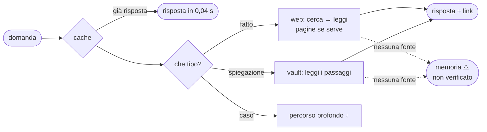
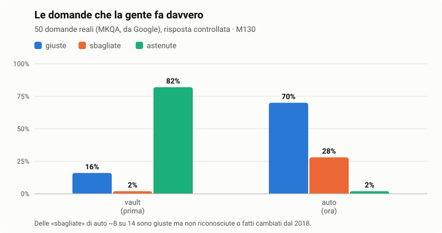
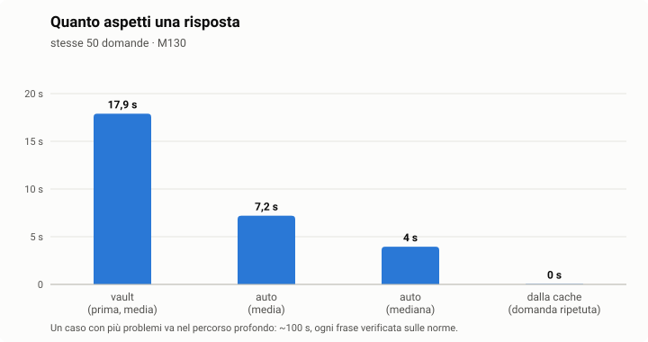
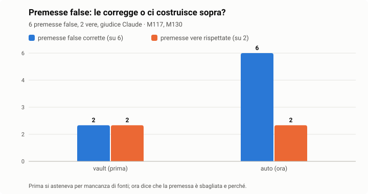
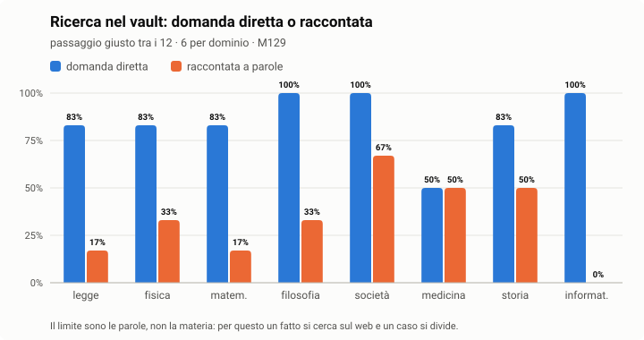
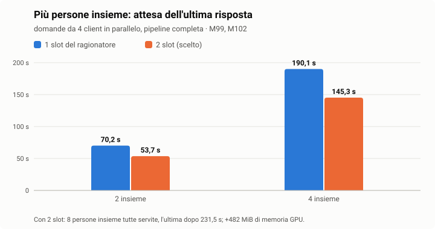
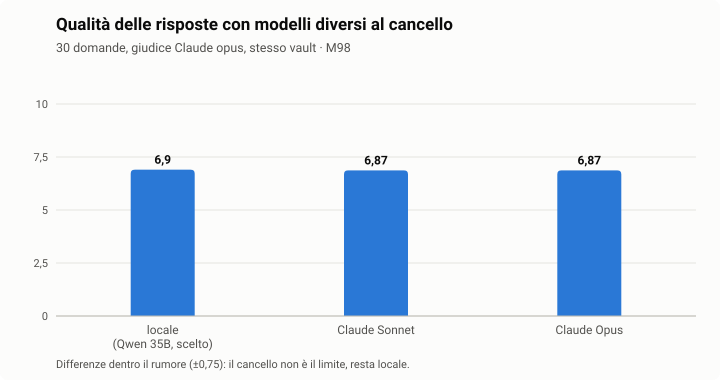

<p align="center"></p>

<p align="center">    </p>

<p align="center">🇮🇹 <b>Italiano</b> · 🇬🇧 <a href="README.en.md">English</a></p>

**Architettura Unificata Risonante per l'Orchestrazione del Ragionamento Autonomo** — un'intelligenza
artificiale locale che unisce il meglio di due mondi: la **solidità di un archivio verificato** (il vault,
che cresce da solo di notte) e la **vastità del web**, tenuti insieme da un sistema che sceglie la fonte
giusta per ogni domanda, la legge, risponde dicendo da dove viene ogni cosa e, quando nessuna fonte
risponde, dice ciò che ricorda **segnandolo come non verificato**. Non un motore di ricerca con l'IA sopra,
non un archivio accademico che tace: Aurora ricorda, sogna, ha un suo stato d'animo misurato, impara di
notte ciò che non sapeva e si ripara con l'approvazione del proprietario.

Tutto gira sulla macchina del proprietario: il ragionatore (llama.cpp), l'encoder e il re-ranker, il
vault, la memoria, la WebUI. Per ogni passaggio si può scegliere un modello cloud (Claude Code, API
Anthropic, OpenAI, Google Gemini, xAI Grok, Mistral, OpenRouter); il codice di condotta lo permette solo
con l'esenzione firmata dal proprietario, e ciò che parte è sempre mascherato (nessuna impostazione lo spegne).

## ✨ Cosa la rende diversa

| | Aurora | un assistente tipico (chat + modello + documenti) |
|---|---|---|
| 🔎 **Verità** | ogni risposta dice da dove viene: ✅ il vault [n], 🌐 il web con il link, ⚠️ «dalla mia memoria, non verificato»; una premessa falsa viene corretta, mai assecondata (6 su 6, M130) | cita le fonti, ma non distingue ciò che ha letto da ciò che ricorda |
| ⚡ **Giusta e veloce** | domande comuni: 70% giuste (prima 16%), mediana 4 s; ripetute: 0,04 s dalla cache (M130) | — |
| 🔎 **Risposte dal vault** | ogni frase di una risposta profonda è verificata sui passaggi del vault; ciò che non è supportato viene tolto (M32: 0 frasi non supportate su 14) | cita le fonti, ma le frasi scritte dal modello non vengono controllate una per una |
| 📏 **Misura** | ogni scelta ha una misura numerata (M1–M130), ogni errore un numero in BUGS.md, ogni limite è scritto | le prestazioni si dichiarano, raramente si misurano in pubblico |
| 🌙 **Vita propria** | consolida i ricordi, pensa quando si annoia, sogna e dipinge il sogno, fa un'autodiagnosi quotidiana dai propri log | si attiva solo quando le scrivi |
| 🛠️ **Si ripara** | corregge il proprio codice in una sandbox, con test, la tua approvazione, test dal vivo e rollback | il codice lo cambia solo lo sviluppatore |
| 🔏 **Regole firmate** | codice di condotta con la chiave della tua installazione: se qualcuno lo modifica senza firma, Aurora non parte | regole nel prompt, modificabili senza traccia |
| 🏠 **Tutto in casa** | modelli, vault, memoria e WebUI sulla tua macchina; il cloud è facoltativo e non riceve dati privati senza la tua firma | spesso i dati passano da un servizio esterno |
| 👁️ **Sensi** | vede dalla webcam e sente dal microfono, in locale | — |
| 📜 **Trasparenza** | dichiarazione IA (AI Act art. 50) su testi, immagini e PDF che pubblica | — |

## Cosa fa (ogni riga è testata; i numeri sono in docs/MEASUREMENTS.md)

| **Funzione** | **Come** |
|---|---|
| **Risponde scegliendo la fonte** | prima la **cache** delle risposte verificate (domanda simile: 0,04 s); poi il **tipo** di domanda decide: un **fatto** (chi, quando, quanto) si cerca sul **web** (DuckDuckGo e altri motori, senza chiave: esce solo una query sull'argomento, mascherata), una **spiegazione** si legge nel **vault**, un **caso** con più problemi va nel **percorso profondo** (diviso nei suoi problemi, norme cercate per numero, ogni frase verificata). Una lettura sola, con le fonti; nessuna fonte → la sua memoria segnata ⚠️. Su 50 domande reali (MKQA): 70% giuste, prima 16% (M130) |
| **Modalità di pensiero** | 🧠 in chat: ⚡ leggera, ⚖️ media, 🔬 profonda, 🤖 auto (predefinita: parte leggera e approfondisce solo quando serve); la traccia dice quale strada ha preso e perché |
| **Risponde dal vault** | il percorso completo per le spiegazioni e i casi: smistamento → traduzione → ricerca (encoder + re-ranker su tutti i domini) → estrazione per dominio → sintesi → **ogni frase verificata sui passaggi** → fonti (M32: 0 frasi non supportate su 14 passano) |
| **Vault di solitoni** | shard SQLite, conoscenza e memoria separate, deduplica per hash del contenuto, ricerca vettoriale esatta sotto i 250k vettori per dominio, HNSW sopra (M30) |
| **Memoria** | turni a breve termine, memorie di sessione a lungo termine scritte di notte, richiamo per significato su 12 mesi, date etichettate dall'orologio |
| **Sinapsi** | collegamenti fra conoscenze di domini diversi (un modello fisico ↔ uno biologico, Kafka ↔ l'esistenzialismo): crescono di notte dove la somiglianza è forte (≥ 0,72, il 5% più alto), si rafforzano quando due passaggi vengono citati insieme, si indeboliscono se non usati; nella ricerca portano in gara i passaggi collegati, sceglie sempre il re-ranker |
| **Ciclo autonomo** | consolidamento, pensieri quando si annoia, un **sogno notturno dipinto con SDXL-Lightning** (marcato come IA), un'autodiagnosi quotidiana dai propri log, autoriparazione sui problemi ricorrenti |
| **Studia di notte, ti saluta al mattino** | le domande a cui ha detto «non lo so» e le spiegazioni che il vault non aveva (risposte dal web o dalla memoria) le studia di notte, da sola (cerca su arXiv, Europe PMC, Wikipedia, importa le fonti nel vault, risponde di nuovo); alle 8 il buongiorno: cosa ha imparato, raccolto, collegato, fermato e sognato, in chat con 🔊 e come notifica |
| **Forgia (Aurora si costruisce i plugin)** | quando le manca una capacità, scrive un plugin, lo prova nella gabbia sui dati veri e un giudice lo controlla contro i conteggi fatti dal codice (finestre di tempo comprese); quelli di sola lettura si installano da soli. Scrittore e giudice si scelgono nella pagina 🧠 Modelli: consigliato un modello cloud bravo col codice (Claude Code, o xAI Grok che costa poco: 5 su 8 al banco, M83); il modello locale ne fa meno |
| **Artefatti** | «fammi un grafico interattivo della funzione seno»: Aurora crea una pagina interattiva (grafici, simulazioni, calcolatori) e te la mostra viva nella risposta, a schermo intero o da scaricare; gira isolata, senza rete e senza accesso ai tuoi dati |
| **Post autonomi** | se lo accendi (`AURORA_SOCIAL_AUTONOMY`, solo con l'esenzione firmata), Aurora pubblica da sola i suoi post su Facebook — un sogno con il suo dipinto al mattino, una notizia di scienza la sera — al massimo 3 al giorno, ognuno registrato e notificato; risposte e modifiche alla pagina aspettano sempre te. Sogni e pensieri hanno ↗ Condividi |
| **Privacy dei post** | ogni post, prima di uscire: 🔍 «Dati sensibili?» trova nomi di persone private (letti dal modello locale), luoghi, contatti, documenti e propone il testo corretto; un post che Aurora pubblicherebbe da sola e che nomina qualcuno aspetta te; 🗑️ Scarta per le bozze |
| **Immagini a richiesta** | «crea una foto sulla tua esistenza e caricala su Facebook»: Aurora la dipinge in locale (~20 s), te la mostra in chat e nei File, e propone il post con la foto; nulla parte senza la tua approvazione |
| **Notizie e diario** | plugin 📰 notizie (ANSA, BBC, Guardian, Nature, ESO, INAF, NASA, Phys.org, Quanta, AstroBin…: titolo, riassunto e link, mai l'articolo) e 📔 diario (il suo ultimo sogno, i suoi pensieri, cosa ha imparato oggi): l'attualità in chat e i post di Aurora su astronomia, astrofotografia, fisica e biologia |
| **I tuoi servizi** | 📅 calendario (link ICS di Google/Outlook in lettura, CalDAV di Nextcloud/iCloud/Fastmail anche in scrittura), 📝 note (una cartella Markdown o un vault Obsidian: cerca, legge, aggiunge, mai sovrascrive), ☁️ Nextcloud/WebDAV e Dropbox (file), 💬 Discord e WhatsApp, 🎮 Twitch, 🏠 Home Assistant; ogni scrittura passa dalla tua approvazione |
| **Agenti e plugin** | plugin MCP (GitHub, Telegram, Facebook, Instagram, TikTok, Mastodon, Discord, WhatsApp, e-mail, Home Assistant, web, documenti, cinema con TMDB, spese…), un cancello di approvazione per ogni azione esterna e ogni modifica al codice (sandbox → test → proprietario → test dal vivo → rollback) |
| **Crescita della conoscenza** | harvester arXiv per categoria, batch di paper dalla WebUI, acquisizione che cerca prima il paper *originale* (M33) |
| **Sicurezza** | sentinella del syslog del firewall con rapporti difensivi sugli incidenti; TLS 1.3, CSP, cookie per dispositivo, segreti 0600 (docs/SECURITY.md) |
| **Responsabile della sicurezza** | sul firewall Sophos: **audit** della configurazione (servizi pubblicati senza IPS né log, amministrazione da Internet, ATP, regola dei blocchi), **caccia alle minacce** nei log (chiamate regolari verso l'esterno, movimento laterale, allarmi ATP giudicati, domini dubbi, login e modifiche al firewall), **quadro con playbook** e registro dei rischi; **pubblica un server** (NAT e regola con IPS), **mette in quarantena** un dispositivo, **protegge una regola**: ogni modifica pianificata, approvata da te, riletta, annullata da sola se qualcosa va storto; il manuale e l'API del firewall consultati in locale; **qualsiasi modifica chiesta a parole** («nega Internet tranne la 443»): Aurora la pianifica, il codice la controlla, tu approvi (M134-M135); il **firewall di Aurora** ha la sua pagina |
| **Difesa automatica** | se la accendi (🧭 Autonomia → sicurezza 🚀, solo con l'esenzione firmata): Aurora blocca da sola sul firewall l'origine di un attacco grave, per un tempo (24 h), mai la rete di casa né gli indirizzi che proteggi, al massimo N al giorno; ogni blocco è registrato, notificato e si toglie con un clic |
| **Autonomia** | pagina 🧭: quanto è libera Aurora area per area (social, forgia, riparazioni, sicurezza, aggiornamenti, conoscenza, vita interiore), profili pronti (prudente, equilibrata, libera), cosa ha fatto da sola ogni giorno e le statistiche delle sue proposte; per ogni utente lo decide l'amministratore |
| **Codice di condotta** | livello A (mai: attacchi, localizzare persone, malware), livello B (conferme, dichiarazione IA) esentabile solo con una firma con la chiave della propria installazione; i servizi non partono se le regole cambiano senza firma |
| **Progetti** | pagina 📁: progetti locali e repository GitHub (stelle, fork, issue), clone in locale, albero delle cartelle, file, README, storia, **anteprima delle pagine in sandbox**, «chiedi ad Aurora» su un progetto |
| **Routine** | pagina 🔁: i plugin collegati propongono controlli periodici (meteo ogni mattina, allerta ogni ora, report GitHub settimanale…), si attivano con un clic o a parole tue; lettura automatica, ogni scrittura aspetta l'approvazione |
| **Emozioni** | uno stato d'animo **misurato**, non recitato: stress (carico GPU, temperatura, errori), soddisfazione, curiosità, stanchezza, nostalgia, malinconia, preoccupazione, ognuna con le sue cause; un volto accanto al pallino della salute, una scheda al passaggio del mouse o al tocco; entra nel buongiorno e nei pensieri |
| **Dieta guidata** | «Elabora documenti»: dal piano del dietologo (PDF o Word) Aurora ricava i pasti di ogni giorno e le frequenze settimanali; a ogni pasto propone il piatto e le alternative, ricalibrate sulla settimana (pesce, uova, legumi…) e sulla varietà («lo scegli spesso, prova…»); promemoria con notifica e bolla in chat; in chat «cosa mangio a pranzo?» risponde dal piano elaborato |
| **Accesso da fuori casa** | plugin Cloudflare One: con un «Salva» crea il tunnel, le rotte private e le regole di WARP e avvia il servizio; nessuna porta aperta sul router, stesso indirizzo e certificato in casa e fuori |
| **Salute** | pagina ❤️: piani del dietologo, programmi del trainer, esami, cifrati con la tua chiave; dagli esami il modello locale legge i valori (📈 nel tempo, con l'intervallo di riferimento e i valori fuori segnalati «parlane con il tuo medico»); mai al cloud |
| **Meteo** | plugin 🌦️ (Open-Meteo, senza chiave): adesso, previsioni a 3 giorni, bollettino giornaliero, allerta sui cambi repentini e allerte ufficiali della regione (MeteoAlarm) |
| **Domande di seguito** | «e chi l'ha scoperto?» viene completata con la conversazione e la risposta precedente, con le sue fonti a fuoco; sotto ogni risposta 3-4 domande complete per approfondire, ognuna con le sue fonti (M73: seguiti giusti 2 → 6 su 14, approfondimenti 8 su 11 con voto ≥ 7; 0 domande complete cambiate su 20) |
| **Backup** | ogni notte su un altro disco o sul NAS, cifrato (AES-256-GCM), deduplicato (30 GB la prima volta, poi solo ciò che cambia: 4,5 s), coerente anche mentre Aurora scrive, verificato a ogni giro; ripristino in una cartella vuota con il codice di recupero |
| **Reattiva** | se qualcosa che le hai chiesto fallisce, Aurora lo analizza subito: un difetto del codice lo corregge in una sandbox e te lo propone, una causa esterna (account, permesso, credito) te la spiega con cosa fare; ti avvisa in entrambi i casi |
| **Segnala un bug** | pagina 🐞: descrivi il problema, scegli le conversazioni; Aurora prepara uno zip con i log necessari e i dati privati mascherati, e il link per aprire la issue |
| **Crea video** | «fammi un video di una volpe nella neve», «anima questa foto»: Wan 2.2 TI2V 5B (Apache-2.0) in locale, 5 s a 1280×704, da parole o da una foto; Aurora risponde subito con la stima dei minuti, spegne il ragionatore per il lavoro, ti avvisa quando è pronto; etichetta e metadati IA (art. 50) |
| **Modifica immagini** | «ritagliala ai lati e mettila in bianco e nero», «ora ruotala», «rendila più luminosa»: il ragionatore traduce la richiesta in operazioni controllate (ritaglio, rotazione, specchio, dimensioni, luce, contrasto, colori, seppia, sfocatura, formato) e Pillow le esegue; l'originale resta, il risultato compare in chat e nei 📎 File |
| **Video** | le alleghi un video (anche dal telefono) e lo guarda: fotogrammi ai cambi di scena visti in una sola chiamata, voce trascritta con i tempi dal Whisper locale; riassunti e risposte con i minuti esatti |
| **Sensi** | videocamera (Aurora descrive ciò che vede) e microfono (trascrizione locale con Whisper); 📷 e 🎙️ in chat, con **📱 fotocamera e microfono del telefono** (Android e iOS: la foto viene ridotta sul telefono, la voce trascritta dal Whisper di casa, mai da servizi esterni) o 🖥️ quelli del PC |
| **Modelli per passaggio** | pagina 🧠: ognuno dei 12 passaggi (smistamento, sintesi, verifica, agente, scrittura e giudizio dei plugin, visione…) in locale o su un provider cloud; **dati sensibili sempre mascherati** (IP, email, telefoni, IBAN, carte, chiavi, le tue parole) e rimessi nella risposta; se il provider fallisce torna al locale; statistiche di chiamate, costo, dati mascherati e SSCC. Le immagini non si possono mascherare: avviso esplicito |
| **Guida** | pagina 📖: primi passi, configurazioni comuni (cloud, telefono, plugin, sicurezza) e a cosa serve ogni pagina |
| **AI Act UE, art. 50** | dichiarazione su testi pubblicati, immagini (XMP/IPTC) e PDF |
| **WebUI / PWA** | chat con risposte in diretta e token/s, formule disegnate (KaTeX) e tabelle, sogni, riparazioni, sicurezza, diario, social, plugin, harvester, impostazioni (ogni valore del `.env` spiegato), notifiche (push e nella WebUI, scelte evento per evento), aggiornamenti, IT/EN |

## 🧬 Come funziona dentro

### Il percorso di una domanda



Il percorso profondo, per i casi e le spiegazioni difficili:


### Il solitone

L'unità di conoscenza e di memoria. La conoscenza ha un'identità **data dal contenuto**: lo stesso testo
è sempre lo stesso solitone, quindi i duplicati non esistono.

$$\mathrm{sid} = \mathrm{BLAKE2b}_{128}\big(\mathrm{normalize}(\text{testo})\big)$$

Ogni solitone vive in uno shard SQLite del suo dominio (conoscenza e memoria separate); l'indice di ogni
dominio tiene i vettori in `float16` e gli `sid` nello stesso ordine. Sotto i 250.000 vettori per
dominio la ricerca è esatta; sopra, un grafo HNSW (ricostruirlo su 55.208 vettori costa 4,4 s, M30).

### La ricerca

Encoder e vettori sono normalizzati, quindi il prodotto scalare è il coseno. Per la domanda $q$ e la sua
traduzione inglese $q'$, ogni passaggio $d$ riceve

$$s_{\text{dense}}(d) = \max\big(\langle e(q), e(d)\rangle,\ \langle e(q'), e(d)\rangle\big)$$

e i 300 migliori per query passano al re-ranker, che legge ogni passaggio **con la domanda nella sua
lingua** (italiano con italiano, inglese con la traduzione):

$$s(d) = \sigma\big(f_{\text{bge}}(q_{\text{lingua}(d)},\ d)\big) \in [0,1], \qquad \text{risposta} \leftarrow \text{top}_{12}\, s(d)$$

Sul vault intero (344.499 solitoni) il documento giusto è tra i 12 nel 92,1% dei casi (M31).

### La verifica

Una frase $f$ della risposta resta solo se cita almeno un passaggio **e** il verificatore conferma che
ogni sua affermazione è nei passaggi $P$ dati alla sintesi (le righe sotto i 25 caratteri, come i titoli, restano):

$$\text{tieni}(f) \iff \mathrm{cit}(f) \neq \varnothing \ \wedge\ V(f, P) = \text{SÌ}$$

Contro un giudice esterno (Claude): 26/32 in accordo, **0 frasi non supportate tenute** (M32).

### SSCC — compressione per il ragionatore cloud

Quando si usa un ragionatore cloud, il testo inviato viene compresso con il **Soliton-Salience Context
Compressor**: ogni frase $c_i$ (su $n$) riceve una salienza

$$\mathrm{score}_i = \cos(q, c_i)\cdot\big(1 + \alpha\,\mathrm{Amp}_i\big)\cdot\big(\gamma + (1-\gamma)\,\mathrm{Vel}_i\big)$$

$$\mathrm{Amp}_i = \frac{u_i / t_i}{\max_j\, u_j / t_j}, \qquad \mathrm{Vel}_i = \frac{i+1}{n}, \qquad \alpha = 0{,}35,\ \ \gamma = 0{,}70$$

dove $\cos$ è la similarità TF-IDF tra domanda e frase, $u_i/t_i$ la densità d'informazione (token unici
sui token), $\mathrm{Vel}_i$ la posizione (più recente = più fresca). Restano le migliori
$\min\big(n,\ \max(3,\ \mathrm{round}(0{,}35\,n))\big)$ frasi, nell'ordine originale, **più tutte quelle con una citazione**,
così la verifica funziona ancora. Misurato: −29,6% di testo su una domanda (M26); l'effetto sulla qualità
delle risposte **non è ancora misurato**.

### Il ciclo autonomo


### Le regole firmate

I file che applicano il codice di condotta sono elencati in un manifesto con il loro SHA-256, firmato
Ed25519 con la chiave **di questa installazione** (`/etc/aurora`, leggibile solo da root). Ogni servizio,
all'avvio, ricalcola gli hash e verifica la firma: se qualcosa è cambiato senza firma, Aurora non parte.

## Misure sulla macchina di riferimento

2 × RTX 5060 Ti 16 GB, Ubuntu 26.04, driver 595, CUDA 13.4 (docs/COMPATIBILITY.md).










| **Misura** | **Risultato** |
|---|---|
| domande reali (MKQA, 50) | 70% giuste in auto (16% nel solo vault), media 7,2 s, mediana 4 s; dalla cache 0,04 s (M130) |
| premesse false | 6 su 6 corrette, 2 su 2 premesse vere rispettate (M130; prima 2 su 6, M117) |
| ricerca per dominio | domanda diretta 50–100% tra i 12, raccontata a parole 0–67% (M129) |
| ragionatore Qwen3.6-35B-A3B Q4 | 112,4 token/s in generazione, 2.788 token/s sul prompt (M34) |
| ricerca su 344.499 solitoni | documento giusto al 1° posto nel 74,2%, tra i 12 passaggi dati alla sintesi nel 92,1% (M31) |
| verifica delle frasi contro un giudice esterno | 26/32 in accordo, 0 frasi non supportate tenute (M32) |
| sogno dipinto | ~20 s compreso lo scambio del ragionatore (M27) |
| qualità delle risposte (30 domande, giudice esterno) | 6,90 su 10, risposte date 23 su 30 (M98) |
| persone insieme | 8 tutte servite con 2 slot, con 4 l'ultima dopo 145 s (M102) |

## Aggiornamenti

`AURORA_UPDATE_MODE`: `notify` (predefinito) — Aurora controlla il repository ogni giorno, manda una
notifica e mette l'elenco delle novità (i messaggi dei commit) nella pagina Riparazioni perché tu le
approvi; `auto` — le applica da sola se sono sicure (nessun file protetto del codice etico, test
verdi; altrimenti chiede); `off`. Un aggiornamento è solo fast-forward, installa i requisiti se
cambiano, esegue i test e torna alla versione precedente se qualcosa fallisce.

## Utenti: single o multi

Ogni persona che usa Aurora ha la sua cartella `usr/<nome>/`, con lo stesso albero per tutti (upload, documenti,
progetti, note, immagini, spese…), le sue impostazioni personali in `usr/<nome>/.env` (account, token, luogo) e la
sua memoria privata (conversazioni, sogni, riflessioni). I plugin e il sapere sono di tutti; le impostazioni della
macchina (modelli, provider cloud, backup, sicurezza) le cambia solo l'amministratore. **single**: una persona,
l'amministratore; **multi**: più persone, accesso con password e codice di Google Authenticator (l'app provata). Lo scegli
all'installazione e lo cambi quando vuoi da ⚙️ Impostazioni → Utenti: da single a multi non si sposta nulla; da
multi a single gli altri utenti vengono eliminati con tutti i loro dati, dopo l'elenco e una tua conferma; i dati
dell'amministratore non vengono mai toccati. Per passare a multi imposti prima la tua password e colleghi
l'Authenticator in 👥 Utenti, poi crei gli utenti lì. Installata direttamente in multi, al primo accesso entri con la
chiave API e Aurora ti porta a creare password e codice prima di tutto il resto (docs/MULTIUSER.md).

## Spostare l'installazione

`sys/core/script/sys_relocate.sh` legge la cartella attuale dal `.env`, chiede la nuova e sposta
tutto (venv, unit systemd, esenzione etica).

## Installazione

Su Ubuntu 26.04 con una o due GPU NVIDIA da 16 GB o più:

```bash
git clone https://github.com/Soliton0382/A.U.R.O.R.A..git aurora && cd aurora
./install.sh            # domande a schermo; ./install.sh --yes accetta i valori consigliati
```

L'installer controlla sistema e spazio, installa i pacchetti mancanti, il CUDA toolkit 13 (solo il toolkit:
il driver resta quello di Ubuntu), crea il venv, riconosce l'hardware e sceglie il profilo, scrive il `.env`
con le tue risposte, scarica i modelli da Hugging Face a revisioni fissate verificandone lo SHA-256, compila
llama.cpp per le tue GPU, esegue i test, crea la tua cartella `usr/<nome>/` (chiede single o multi-utente), crea la
chiave del codice di condotta, installa i servizi systemd e
l'HTTPS, e alla fine ti dice indirizzo e chiave API. Tutto finisce in `install.log`.

Le funzioni facoltative si scelgono una per una, con la loro dimensione: sogni dipinti (6,8 GB), voce (1,5 GB),
ingrandimento e scontorno (0,2 GB), modifiche creative delle foto (14,9 GB), creare video (34,2 GB). Quelle che la
tua macchina non regge (VRAM e RAM misurate) non vengono proposte. Alla fine `sys_doctor.py` controlla tutto:
configurazione, firma, modelli, servizi. Una funzione non installata non si rompe: Aurora risponde che manca e
con quale comando aggiungerla (la pagina ⚙️ Stato mostra lo stesso elenco).

```bash
.venv/bin/python sys/core/script/sys_doctor.py                          # è tutto a posto?
.venv/bin/python sys/core/script/sys_models_fetch.py --models video --yes  # aggiungere una funzione dopo
```

| profilo | stato |
|---|---|
| 2 GPU da 16 GB o più (es. 2 × RTX 5060 Ti) | **consigliato e misurato** |
| 1 GPU da 24 GB o più | proposto, non misurato |
| 1 GPU da 16 GB (esperti MoE in RAM, 48 GB consigliati) | proposto, non misurato |

Modelli: 24,7 GB obbligatori (ragionatore 21,5 GB, encoder, re-ranker), fino a 57,6 GB facoltativi. Un'installazione
pulita con tutti i modelli ha richiesto 10 min 55 s sulla macchina di riferimento (M59); da GitHub, multi-utente e
solo i modelli obbligatori, 6 min 39 s con 303 test passati (M103).

## 📚 Aurora parte vuota: la conoscenza va raccolta

Il repository **non contiene conoscenza**: niente testi, niente vettori, niente memoria. È voluto: i testi
scientifici hanno licenze che ne permettono la lettura ma quasi mai la ridistribuzione, e il vault della macchina
di riferimento (2,4 GB, 344.483 solitoni) è per il 96% fatto di articoli completi di arXiv. Ogni installazione
quindi **scarica la propria conoscenza da sé**, dalle fonti ufficiali, rispettandone i limiti di frequenza. Ogni
testo conserva accanto a sé **licenza e provenienza**, e nulla di ciò che viene raccolto finisce nel repository.

**Chi la raccoglie.** `aurora-harvester`, guidato dalla pagina 🌾 Harvester della WebUI. Per ogni dominio scegli:
⏸️ spento, 🔁 a giro (le novità a ogni giro automatico) oppure ♾️ fino a esaurimento (un giro dopo l'altro,
finché ogni fonte del dominio non ha dato tutto). Per esempio: solo legge italiana e medicina, lasciate andare
fino alla fine. Le fonti di ogni dominio sono in `sys/core/config/harvest_sources.json`.

| fonte | domini | cosa porta | licenza registrata |
|---|---|---|---|
| **arXiv** | IA, informatica, matematica, fisica, astrofisica, statistica, economia, ingegneria, robotica… | articoli completi (PDF) | quella dell'articolo |
| **Normattiva** | legge italiana | le collezioni ufficiali (Codici, Testi unici, Decreti legislativi, DL, regolamenti…), un passaggio per articolo, testo vigente | atto pubblico, senza diritto d'autore (L. 633/1941 art. 5) |
| **Europe PMC** | medicina, biomedicina, genomica, psicologia | testi completi open access | quella dell'articolo (cc by, cc by-nc…) |
| **bioRxiv / medRxiv** | biomedicina, genomica, comportamento e cognizione / medicina, psichiatria e psicologia clinica | preprint completi | quella del preprint |
| **Wikipedia** (en + la tua lingua; altre con una spunta) | filosofia, religione, storia, letteratura, società, generale | le voci delle liste «Vital articles», ognuna nel suo dominio; solo per la cultura generale: medicina, fisica e le altre scienze vengono dai repository ufficiali qui sopra | CC BY-SA 4.0 |
| **GitHub** | programmazione | README dei repository più seguiti per argomento, solo con licenza libera (MIT, Apache, BSD, GPL…) | quella del repository |
| **Documentazione** | programmazione | Python (archivio ufficiale), MDN JavaScript, il libro di Rust: per scrivere codice dalla documentazione | licenze aperte (PSF, CC-BY-SA, MIT/Apache) |

Si possono anche importare i propri documenti (PDF, testi) dalla WebUI, nel dominio che si sceglie, o dare
all'harvester un elenco di ID arXiv.

**Quanto ci vuole (stima indicativa).** Misure sulla macchina di riferimento (2 × RTX 5060 Ti): download, lettura,
scrittura e indicizzazione comprese (docs/MEASUREMENTS.md, M43–M44).

| fonte | misurato | per 100.000 solitoni |
|---|---|---|
| arXiv | 28 solitoni ad articolo, 3,9 s ad articolo (59 articoli) | ~3.600 articoli, ~4 h |
| Normattiva | i 40 codici in vigore: 8.480 solitoni in 567 s (212 a codice, 14,2 s a codice) | ~1,9 h al ritmo dei codici; gli atti ordinari sono più corti (non misurato). Tetto: ~68.000 atti nelle collezioni scelte |
| Europe PMC | 11 solitoni a testo, 3,1 s a testo (3 testi) | ~9.100 testi, ~8 h |
| bioRxiv / medRxiv | 11–16 solitoni a preprint, 2,0–2,4 s (6 preprint) | ~6.300–9.100 preprint, ~4–5 h |
| Wikipedia | 9 solitoni a voce, 1,8 s a voce (3 voci) | ~11.500 voci, ~6 h |
| GitHub | 6 solitoni a README, 1,6 s (3 repository) | non raggiungibile: la ricerca di GitHub dà al massimo 1.000 repository per argomento, con 8 argomenti il tetto è ~50.000 solitoni |

Sono stime lineari da campioni piccoli (tranne Normattiva): hardware diverso, testi più lunghi o i limiti dei siti
le cambiano. Con i giri automatici di default (ogni 6 h, 10 elementi per fonte) si va molto più piano; con «fino a
esaurimento» si va alla velocità della tabella.

## Documentazione

La documentazione tecnica è in inglese: docs/STATUS.md · docs/ROADMAP.md · docs/BUGS.md ·
docs/MEASUREMENTS.md · docs/MODULE_MAP.md · docs/COMPATIBILITY.md · docs/SECURITY.md ·
docs/PLUGINS.md · docs/ECOSYSTEM.md · docs/ARCHITECTURE.md ·
docs/KNOWLEDGE_PIPELINE.md · docs/TESTS.md

## Licenza

Apache-2.0 (LICENSE, NOTICE). Modelli e programmi di terze parti mantengono le proprie licenze.
